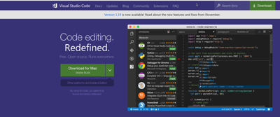
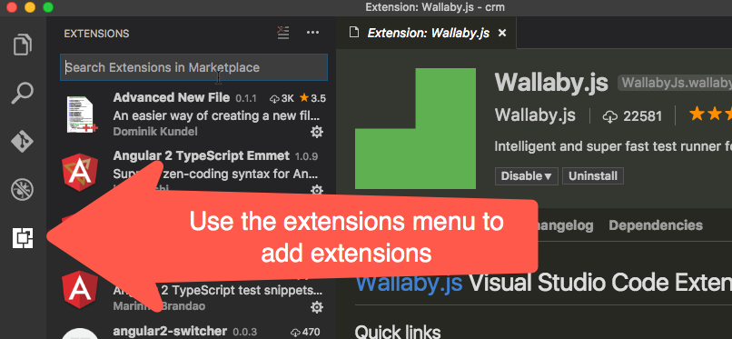
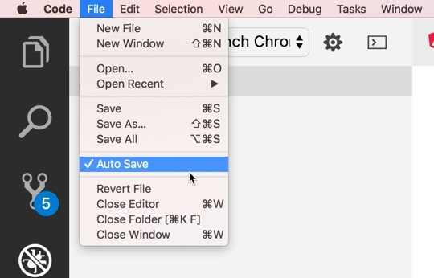

# 0 - Environment setup

Dependency checklist:

1. node v6+
2. git
3. cli.angular.io
4. nrwl schematics
5. visual studio code
6. visual studio code extensions
7. chrome extension for redux dev tools

The main dependency for being able to make an Angular application is node version 6+. The latest stable version of node is best to get if you do not have it already installed.

## Check you have the right node and git

You can check your version of node by running the following command in the terminal.

```text
node -v
```

If you would like to use source control and check out completed work then it is recommended to have git installed on your machine. You can download git from[ https://git-scm.com/downloads ](https://git-scm.com/downloads%20)

You can check your version of node by running the following command in the terminal.

```text
git --version
```

If you do not have node installed or you are using a version lower than v4 then I you can get the latest stable version from [www.nodejs.org](https://github.com/duncanhunter/Enterprise-Angular-Applications-With-NgRx-and-Nx-Book/tree/d63a57a9f1ea36a7623cdf0746dd90b1406edaa2/www.nodejs.org).

## Install Angular CLI and NX

We need to have both the Angular CLI and the nrwl schematics installed globally. Run the following commands.

```text
npm install -g @angular/cli
```

```text
npm install -g @nrwl/schematics
```

## **Get Visual Studio Code**  

[**https://code.visualstudio.com/**](https://code.visualstudio.com/)



## Get **Visual Studio Code**  Extensions

## Optionally turn on **Visual Studio Code  autosave**



### 7. Install redux dev tools chrome extension

[https://github.com/zalmoxisus/redux-devtools-extension](https://github.com/zalmoxisus/redux-devtools-extension)


