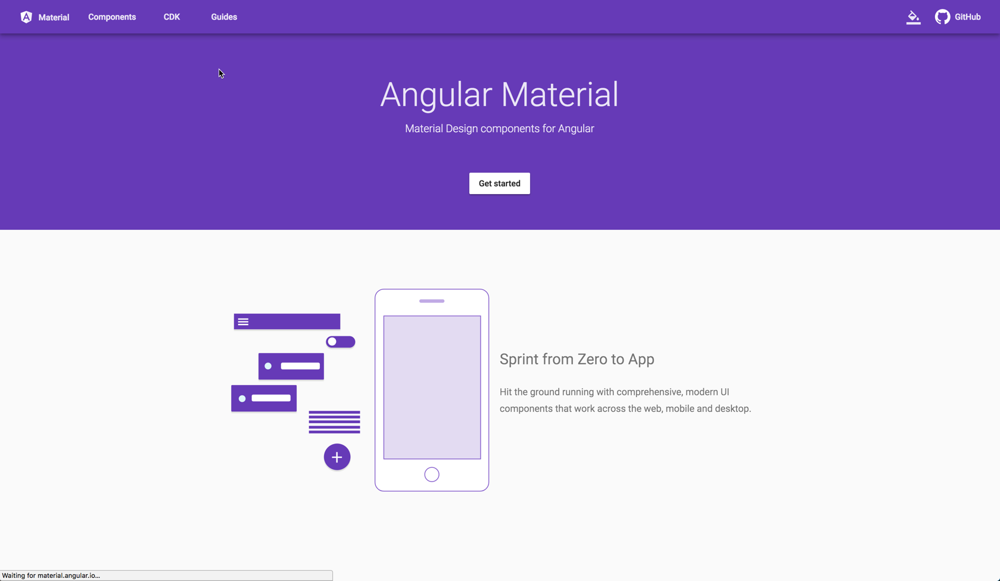

# 6 - Thirdparty Dependencies



[https://material.angular.io/](https://material.angular.io/)

## 1.Install angular material, angular animations and angular flex layout


Note: As of Angular v6 you no longer need to manually add Angular material you can use the new "Add" CLI command.

Always use the same Major version of Material as your Angular CLI and packages.

```bash
ng add @angular/material
```


```text
npm install @angular/material @angular/cdk @angular/flex-layout @angular/animations
```

* Add animations module to the main app module.



```typescript
import { BrowserModule } from '@angular/platform-browser';
import { NgModule } from '@angular/core';

import { AppComponent } from './app.component';
import { NxModule } from '@nrwl/nx';
import { RouterModule } from '@angular/router';
import { authRoutes, AuthModule } from '@demo-app/auth';
import {BrowserAnimationsModule} from '@angular/platform-browser/animations';

@NgModule({
  declarations: [AppComponent],
  imports: [
    BrowserModule,
    BrowserAnimationsModule,
    NxModule.forRoot(),
    RouterModule.forRoot([{path: 'auth', children: authRoutes}], { initialNavigation: 'enabled' }),
    AuthModule
  ],
  providers: [],
  bootstrap: [AppComponent]
})
export class AppModule {}

```



## 2. Add a new Nx lib to hold all the common material components we will use in our apps

```bash
ng g lib material
```

* Add all the common material components and re-export them



```typescript
import { NgModule } from '@angular/core';
import { FlexLayoutModule } from '@angular/flex-layout';

import {
  MatInputModule,
  MatCardModule,
  MatButtonModule,
  MatSidenavModule,
  MatListModule,
  MatIconModule,
  MatToolbarModule,
  MatProgressSpinnerModule,
  MatMenuModule,
  MatTableModule,
  MatSelectModule
} from '@angular/material';

@NgModule({
  imports: [
    FlexLayoutModule,
    MatInputModule,
    MatCardModule,
    MatButtonModule,
    MatSidenavModule,
    MatListModule,
    MatIconModule,
    MatToolbarModule,
    MatProgressSpinnerModule,
    MatMenuModule,
    MatTableModule,
    MatSelectModule
  ],
  exports: [
    FlexLayoutModule,
    MatInputModule,
    MatCardModule,
    MatButtonModule,
    MatSidenavModule,
    MatListModule,
    MatIconModule,
    MatToolbarModule,
    MatProgressSpinnerModule,
    MatMenuModule,
    MatTableModule,
    MatSelectModule
  ]
})
export class MaterialModule {}
```



* Add material module to auth module



```typescript
import { MaterialModule } from '@demo-app/material';

@NgModule({
  ...
imports: [CommonModule, RouterModule, HttpClientModule, MaterialModule],
  ...
})
export class AuthModule { }
```



## 3. Add material default styles



```css
@import '~@angular/material/prebuilt-themes/deeppurple-amber.css';
```



* Update the login-form to use material components



```markup
<mat-card>
    <mat-card-title>Login</mat-card-title>
    <mat-card-content>
        <form fxLayout="column" fxLayoutAlign="center none">
            <mat-form-field>
                <input matInput placeholder="username" type="text" #username>
            </mat-form-field>
            <mat-form-field>
                <input matInput placeholder="password" type="text" #password>
            </mat-form-field>
        </form>
        <button mat-raised-button (click)="login({username:username.value, password:password.value})">login</button>
    </mat-card-content>
</mat-card>
```



## 4. Go and explore flex layout docs

[https://tburleson-layouts-demos.firebaseapp.com/\#/docs](https://tburleson-layouts-demos.firebaseapp.com/#/docs)

